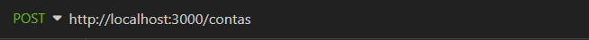
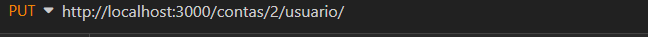
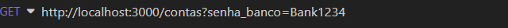
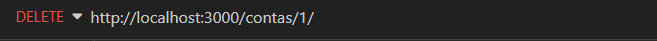
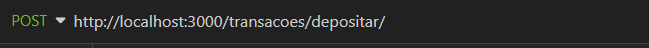
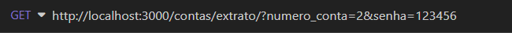
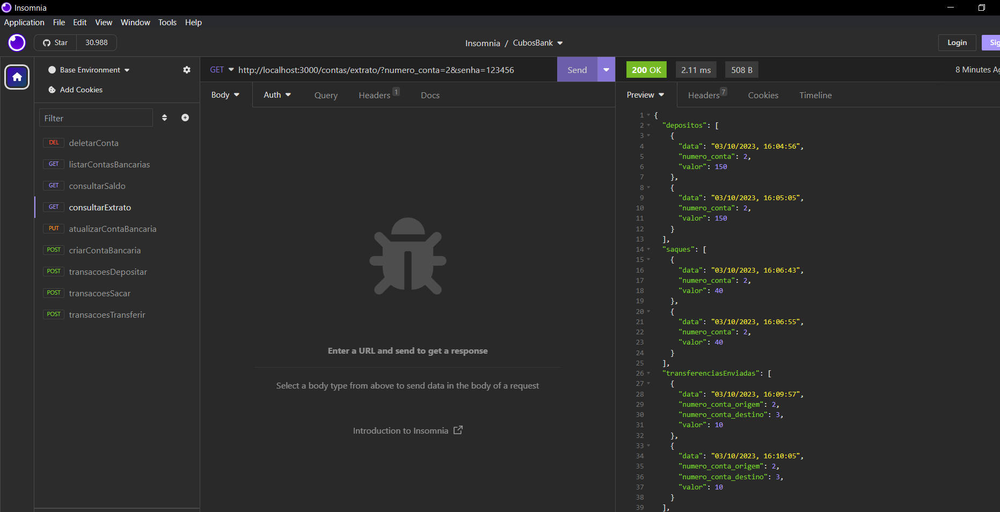

# API-REST-BANCO 🏦 
API - Sistema Bancário
# 📋 Descrição do projeto 
Construção de uma  <strong>API - Application Programming Interface</strong> ,  interface de programação de aplicação.
Para realização de operações bancárias . Seguindo os conjuntos de restrições de arquitetura <strong>REST.</strong>
# Funcionalidades do Projeto 
✅ Criar Conta Bancária 
✅ Atualizar Conta  
✅ Listar Contas  
✅ Deletar Conta 
✅ Consultar Saldo da Conta 
✅ Depositar 
✅ Fazer transferências entre  
✅ Sacar 
✅ Consultar Extrato da Conta  
<h1>:hammer_and_pick: Tecnologias Utilizadas</h1>

# Implementação do Projeto
- Primeiro faça o Fork do Projeto.
- Depois clone o repositório para seu ambiente: 
  Digite o comando <strong>git clone + a chave ssh do Projeto.</strong>
# 🚀 Inicialização 
Para inicializar o projeto no terminal com as dependências necessárias digite:
- npm install nodemon
- npm install express

# Execução do Projeto 

  O projeto pode ser executado utilizando o <strong style ="color:purple">Insomia</strong>
    Através das Rotas Abaixo:
  - Criar Conta 
  
  - Atualizar Conta
  
  - Listar Contas
  
  - Deletar Conta
  
  - Consultar Saldo
  
  - Depositar
    
  - Sacar
    
  - Transferir
    
  - Consultar Extrato
    

# Imagem da rota Extrato

<h1> 🤝 Contribuições</h1>
 Siga os passos abaixo para contribuir:

1. Faça o fork do projeto (https://github.com/CarolinaSanches24/API-REST-BANCO)

2. Clone o seu fork para sua maquína (git clone https://github.com/user_name/REPO_NAME.git)

3. Crie uma branch para realizar sua modificação (git checkout -b feature/name_new_feature)

4. Adicione suas modificações e faça o commit (git commit -m "Descreva sua modificação")

5. Push (git push origin feature/name_new_feature)

6. Crie um novo Pull Request

7. Pronto, agora só aguardar a análise
<h2>✒️ Autora</h2>
<strong>Carolina Sanches</strong>
